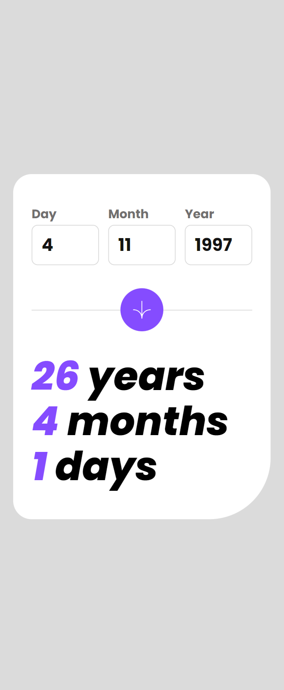

# Frontend Mentor - Age calculator app solution

This is a solution to the [Age calculator app challenge on Frontend Mentor](https://www.frontendmentor.io/challenges/age-calculator-app-dF9DFFpj-Q). Frontend Mentor challenges help you improve your coding skills by building realistic projects. 

## Table of contents

- [Overview](#overview)
  - [The challenge](#the-challenge)
  - [Screenshot](#screenshot)
  - [Links](#links)
- [My process](#my-process)
  - [Built with](#built-with)
  - [What I learned](#what-i-learned)
  - [Continued development](#continued-development)
  - [Useful resources](#useful-resources)
- [Author](#author)
- [Acknowledgments](#acknowledgments)

## Overview

### The challenge

Users should be able to:

- View an age in years, months, and days after submitting a valid date through the form
- Receive validation errors if:
  - Any field is empty when the form is submitted
  - The day number is not between 1-31
  - The month number is not between 1-12
  - The year is in the future
  - The date is invalid e.g. 31/04/1991 (there are 30 days in April)
- View the optimal layout for the interface depending on their device's screen size
- See hover and focus states for all interactive elements on the page
- **Bonus**: See the age numbers animate to their final number when the form is submitted

### Screenshot

### Links

- Solution URL: [GitHub](https://github.com/rawrisotto/age-calculator-app-main)
- Live Site URL: [Netlify](https://65e1789c2c19118e3424a06d--meek-macaron-821a4c.netlify.app/)

## My process

### Built with

- Semantic HTML5 markup
- CSS custom properties
- Flexbox
- Mobile-first workflow
- JavaScript

### What I learned

Tried implementing vanilla JavaScript for the first time. Learned quite a lot of basics and syntax from [Scrimba](https://scrimba.com/learn/learnjavascript).

### Continued development

Continue learning JavaScript to optimize code and make it neater. CSS can be a bit better and follow DRY.

### Useful resources

- [Learn JavaScript](https://scrimba.com/learn/learnjavascript) - This helped me to learn JavaScript. Very easy to follow and purposeful exercises.

## Author

- GitHub - [rawrisotto](https://github.com/rawrisotto)
- Frontend Mentor - [@rawrisotto](https://www.frontendmentor.io/profile/rawrisotto)

## Acknowledgments

Would like to acknowledge Per Harald Borgen, CEO of Scrimba for the wonderful and easy to follow lessons over at [Scrimba](https://scrimba.com/). Would recommend for those eager to learn Frontend Development.
